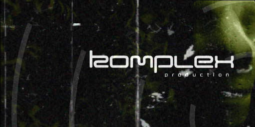

# Screenshot references

The archived [Pouët production page](../original/pages/pouet-888.html) links
Pouët **888** to [Demozoo production **21114**](https://demozoo.org/productions/21114/).
The Demozoo record identifies **GODOG by Komplex** and links to its
[full screenshot gallery](https://demozoo.org/productions/21114/screenshots/).

## Recovered image



| Field | Value |
| --- | --- |
| Local artifact | `original/screenshots/demozoo/936a.82379.png` |
| Source | <https://media.demozoo.org/screens/o/e2/b4/936a.82379.png> |
| Discovery | Full-size image hyperlink on Demozoo production 21114, exposed by the web reader |
| Retrieved | 2026-10-08 |
| Format / dimensions | PNG, 512 × 256 pixels |
| Visible content | Komplex production logo over a dark green, textured background |
| Capture date, uploader, JVM and hardware | Unknown |
| Validation | HTTP 200; Pillow 12.1.0 integrity check and complete decode; visual inspection |

The image was saved byte-for-byte, without resizing or re-encoding. Its dimensions
match the original applet declaration, but this does not establish its capture
conditions. Provenance, byte size and SHA-256 are in the
[manifest](../original/manifest.json); the image and HTTP evidence are covered by
[SHA256SUMS](../original/SHA256SUMS).

## Recovery limit

**One image has been recovered; the gallery is not complete.** The web reader
could read the production record and expose this image link, but its gallery
output did not expose individual image URLs. Direct production, gallery and API
requests returned HTTP 403. A public reader service and an isolated headless
Chrome session reached the Cloudflare security challenge instead of the gallery.
No gallery HTML was successfully archived, and no challenge response is presented
as production content. HTTP failures and the reader response are retained under
[`demozoo-recovery-attempts/`](demozoo-recovery-attempts/).

Future recovery should resume from the gallery when it is accessible and append
new images without replacing this reference. Historical third-party captures
belong in `original/screenshots/`; `img/` remains for project communication images.

To retrieve this exact image again without replacing the archived copy:

```bash
recovery_dir=$(mktemp -d)
curl --fail --location --retry 2 --connect-timeout 20 --max-time 90 \
  --output "$recovery_dir/936a.82379.png" \
  'https://media.demozoo.org/screens/o/e2/b4/936a.82379.png'
```
